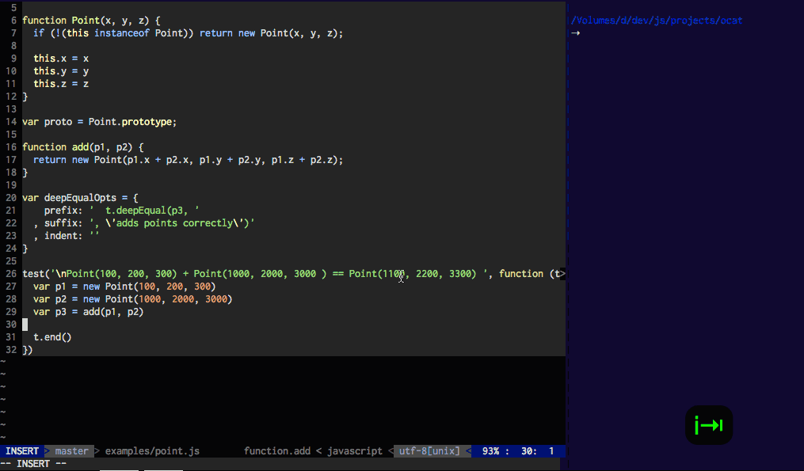

# ocat 

Inspect an object various ways in order to easily generate test cases.

## Installation

    npm install ocat

## [API](http://thlorenz.github.io/ocat)

<!-- Generated by documentation.js. Update this documentation by updating the source code. -->

### ocat.bag

Inspects object and adds results to a bag.
This entire bag is logged at `process.on('exit')`.

**Parameters**

-   `obj` **[Object](https://developer.mozilla.org/en-US/docs/Web/JavaScript/Reference/Global_Objects/Object)** to inspect
-   `opts` **[Object](https://developer.mozilla.org/en-US/docs/Web/JavaScript/Reference/Global_Objects/Object)** options (same as @see ocat.log)

### ocat.file

Same as @see ocat.log, but writes to ocat.tmpFile \* at `/tmp/ocat.txt`
on Unixes and who knows on Windows (`os.tmpdir()/ocat.txt`).

This is useful if you want to read isolated ocat output into your editor
without other output, i.e. by your test runner.

**Vim Example**:

    :r !OCAT_COLOR=0 OCAT_DEPTH=0 OCAT_RM=1 node % 2>&1 > /dev/null && cat /tmp/ocat.txt

will read the ocat printed output right into your editor.
You should probably bind that to a shortcut. ;)

**Tail Example**:

In another terminal pane do:

    tail -f /tmp/ocat.txt

to see logged objects every time you run your tests/code.

**Parameters**

-   `obj` **[Object](https://developer.mozilla.org/en-US/docs/Web/JavaScript/Reference/Global_Objects/Object)** to inspect
-   `opts` **[Object](https://developer.mozilla.org/en-US/docs/Web/JavaScript/Reference/Global_Objects/Object)** options (same as @see ocat.log) with `color: false`

### ocat.log

Inspects object and logs it to _stderr_ immediately.

The given opts override all other options for each supplied property, which are derived as follows:

1.  ocat.opts, the default opts:
    `prefix: '', suffix: '', indent: '', color: true, depth: 1, commaFirst: true`
2.  `OCAT_COLOR` and `OCAT_COMMAFIRST` to override the related defaults, i.e.
    `OCAT_COLOR=0 node my.js` includes no colors
3.  opts passed to `ocat.create` for that `ocat` instance only
4.  opts passed to `ocat.log` and `ocat.bag`

**Parameters**

-   `obj` **[Object](https://developer.mozilla.org/en-US/docs/Web/JavaScript/Reference/Global_Objects/Object)** object to inspect
-   `opts` **[Object](https://developer.mozilla.org/en-US/docs/Web/JavaScript/Reference/Global_Objects/Object)** options inherit from opts passed to `create` and then `ocat.opts`.
    -   `opts.prefix` **[String](https://developer.mozilla.org/en-US/docs/Web/JavaScript/Reference/Global_Objects/String)?** the prefix to insert before the logged object
    -   `opts.suffix` **[String](https://developer.mozilla.org/en-US/docs/Web/JavaScript/Reference/Global_Objects/String)?** the suffix to insert after the logged object
    -   `opts.indent` **[String](https://developer.mozilla.org/en-US/docs/Web/JavaScript/Reference/Global_Objects/String)?** the indentation to apply to each line
    -   `opts.color` **[Boolean](https://developer.mozilla.org/en-US/docs/Web/JavaScript/Reference/Global_Objects/Boolean)?** if `true` logging in colors
    -   `opts.depth` **[Number](https://developer.mozilla.org/en-US/docs/Web/JavaScript/Reference/Global_Objects/Number)?** depth to which the object is inspected
    -   `opts.commaFirst` **[Boolean](https://developer.mozilla.org/en-US/docs/Web/JavaScript/Reference/Global_Objects/Boolean)?** if `true` commaFirst style is used when logging without color\*\* (default: `true`)

### ocat.applyRes5Opts

Applies preconfigured opts with prefix + indentation and depth
that work well in lots of scenarios.

### ocat.opts

Start out as default options @see ocat.log.
Allow overriding ocat options for **all** instances.

### ocat.resetOpts

Resets ocat.opts to default opts.

### ocat.create

Creates an ocat instance with the supplied options.

**Parameters**

-   `opts` **[Object](https://developer.mozilla.org/en-US/docs/Web/JavaScript/Reference/Global_Objects/Object)** options (same as @see ocat.log)

Returns **[Object](https://developer.mozilla.org/en-US/docs/Web/JavaScript/Reference/Global_Objects/Object)** ocat instance

### ocat.tmpFile

The file into which ocat.file writes.
Set it to any other path you like to use instead.

### ocat.rm

Removes the ocat.tmpFile
If the an env var `OCAT_RM=1` is present, the file is removed on startup.

## License

MIT
